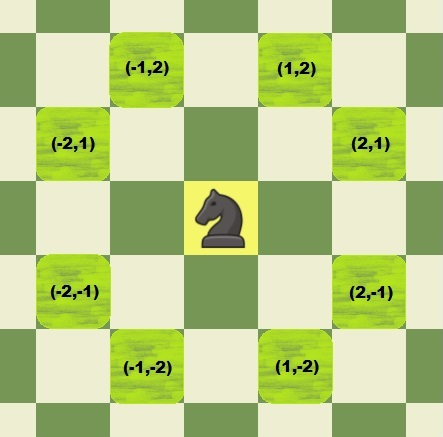
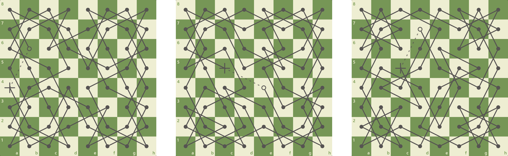
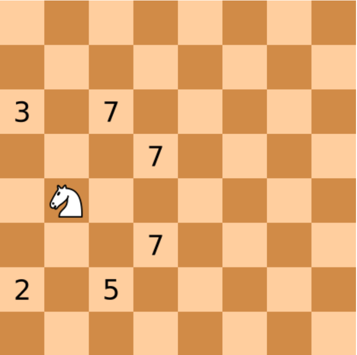

# THE KNIGHT'S TOUR PROBLEM

## Problema
Problema Turului Calului (The Knight's Tour Problem) constă în a alege o pozitie de pe tabla de sah de unde un cal porneste si reuseste sa ocupe fiecare pozitie, pasind pe patrate o singura data.

#### Miscarea Calului

Asadar calul poate alege dintre 8 "salturi" de la o singura pozitie.

#### Este posibila aceasta problema?

Desi la prima impresie nu ai crede ca e posibil ca *fiecare* patratel de pe tabla sa fie ocupat pornind de pe *orice* pozitie. Pe o tabla normala de sah de 8x8 exista 26,534,728,821,064 de variante de circuite complete.

## Rezolvarea

Pentru rezolvarea problemei am abodrat regula Warnsdorff, o metoda "[greedy](https://en.wikipedia.org/wiki/Greedy_algorithm)" pentru găsirea unui tur al unui singur cal. Calul este mutat astfel încât să avanseze întotdeauna către pătratul din care calul va avea cel mai mic număr de mișcări ulterioare. Atunci când calculăm numărul de mișcări ulterioare pentru fiecare pătrat candidat, nu luăm în considerare mișcările care revizitează orice pătrat deja vizitat.

